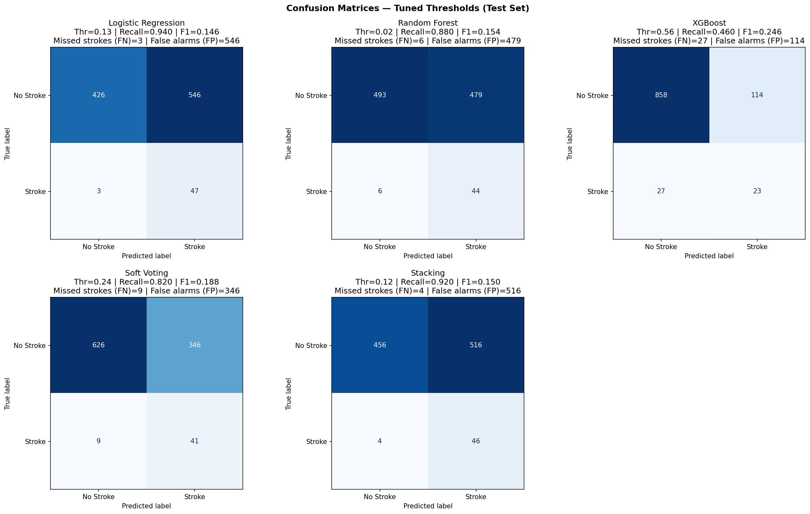

## Team Details

**Team Name:** CodeNexus  
**University:** University of Moratuwa  
**Team Members:**  

- R.P.M. Vithanage
- S.E.N. S. Silva

## Abstract

This report presents a stroke-risk prediction study built on patient health and lifestyle data. The original dataset contained 9,722 records, but deduplication revealed 4,612 exact clinical duplicates that had artificially inflated the stroke-positive class. After correction, the true dataset contains 5,110 unique patients with a stroke prevalence of 4.87%.

The analysis combines exploratory data analysis, statistical testing, feature engineering, and leakage-safe machine learning. We evaluate Logistic Regression, Random Forest, XGBoost, Soft Voting, and a Stacking Ensemble. The final results show that threshold tuning is essential in this highly imbalanced clinical setting, and that a simpler model can outperform a more complex one on recall, while stacking achieves the best overall precision-recall tradeoff.

## 1. Introduction

Stroke is a major global health problem and a leading cause of death and long-term disability. The World Health Organization estimates that about 15 million people experience a stroke each year, with roughly 5 million deaths and another 5 million people left permanently disabled. Stroke can cause paralysis, speech impairment, cognitive dysfunction, and vision loss, making early risk detection clinically important.

This study addresses three goals:

- build a machine learning pipeline that remains reliable under severe class imbalance;
- identify the most influential clinical and lifestyle risk factors;
- provide evidence-based insight to support prevention and early screening.

The central methodological contribution is the detection and removal of duplicate stroke-positive records. Training on the original balanced-looking file would produce overly optimistic metrics that do not reflect real-world deployment.

## 2. Dataset and Preprocessing

### 2.1 Dataset Description

The dataset contains demographic, medical, and lifestyle variables, with `stroke_event` as the binary target. The main predictors include age, hypertension, heart disease, glucose level, BMI, smoking habit, marital status, employment type, and residence.

| Variable | Type | Description | Modelling Status |
|---|---|---|---|
| `patient_id` | Identifier | Unique record identifier | Excluded |
| `gender` | Categorical | Patient gender | Encoded |
| `age` | Continuous | Age in years | Retained |
| `has_hypertension` | Binary | Hypertension indicator | Retained |
| `has_heart_disease` | Binary | Heart disease indicator | Retained |
| `marital_status` | Binary | Married or not | Retained |
| `employment_type` | Categorical | Work status | Encoded |
| `residence` | Categorical | Urban or rural | Encoded |
| `glucose_level` | Continuous | Blood glucose level | Retained |
| `bmi_value` | Continuous | Body Mass Index | Imputed |
| `smoking_habit` | Categorical | Smoking status | Encoded |
| `stroke_event` | Binary target | Stroke occurrence | Target |

### 2.2 Data Integrity

The original file contains 9,722 rows. After removing duplicates using all clinical fields except `patient_id`, the dataset reduces to 5,110 unique patients. This correction is critical because the duplicates were concentrated in the stroke-positive class. Keeping them would leak repeated samples into both training and test partitions and inflate measured performance.

### 2.3 Feature Engineering

The final pipeline uses clinically meaningful engineered features:

| Feature | Formula | Rationale |
|---|---|---|
| `age_squared` | `age^2` | Non-linear risk acceleration with age |
| `is_senior` | `1 if age >= 55` | High-risk age flag |
| `age_x_hypertension` | `age * hypertension` | Joint age and blood pressure burden |
| `age_x_heart_disease` | `age * heart disease` | Combined age and cardiac risk |
| `cvd_count` | `hypertension + heart disease` | Total cardiovascular burden |
| `glucose_x_bmi` | `glucose * bmi` | Metabolic interaction |
| `glucose_per_bmi` | `glucose / (bmi + 1)` | Risk ratio style feature |
| `bmi_deviation` | `|bmi - 25|` | Distance from healthy BMI |
| `log_glucose` | `log(glucose + 1)` | Skew reduction |
| `age_over_10` | `age / 10` | Scale adjustment |
| `age_x_glucose` | `age * glucose` | Age-metabolic interaction |

### 2.4 Missing Value Imputation

BMI missingness is handled using grouped median imputation by gender and age band. This is more realistic than a global median because BMI naturally varies across age and sex groups. Imputation statistics are fit only on training data, then applied separately to validation and test data to avoid leakage.

### 2.5 Leakage Prevention

We exclude derived or potentially circular variables from model input:

- `age_group`
- `bmi_category`
- `high_glucose`
- `risk_score`
- `lifestyle_risk`

These columns are either redundant or too close to the target to be safe for honest prediction.

## 3. Exploratory Data Analysis

### 3.1 Class Balance

The corrected dataset shows the true clinical imbalance: 4,861 non-stroke cases and 249 stroke cases.

{fig-alt="Class balance bar chart"}

### 3.2 Numeric Feature Distributions

Age, glucose level, and BMI all show visible differences between stroke and non-stroke patients. Age is the clearest separator, while glucose and BMI exhibit right-skewed distributions that justify transformation and interaction features.

{fig-alt="Numeric distribution plots"}

### 3.3 Categorical Patterns

Stroke prevalence varies across groups for smoking, employment, residence, and gender. These plots help identify which variables may matter mainly through interaction effects rather than direct linear association.

{fig-alt="Categorical count plots"}

### 3.4 Boxplots

Boxplots highlight the shift in age and glucose levels for the stroke class. BMI is more overlapping, but still contributes when combined with other features.

{fig-alt="Boxplots by stroke status"}

### 3.5 Correlation Heatmap

The correlation matrix confirms that age is the strongest single numeric predictor, while the engineered features capture additional non-linear structure.

{fig-alt="Correlation heatmap"}

## 4. Statistical Analysis

### 4.1 Hypothesis Testing

We use Mann-Whitney U tests for continuous variables and chi-square tests for categorical variables. This is appropriate because the distributions are not assumed to be normal and several predictors are categorical.

{fig-alt="Statistical tests summary"}

The broad conclusion from these tests is:

- age is significantly different between stroke and non-stroke groups;
- glucose level is significantly higher in the stroke group;
- BMI also differs meaningfully;
- hypertension, heart disease, marital status, and smoking habit show significant categorical association;
- gender and residence are not strongly significant on their own, even though they can still matter in interaction-based models.

### 4.2 Interpretation

The statistical tests support the feature engineering strategy. Age is not only the strongest raw predictor, but also benefits from non-linear transformation. Cardiovascular burden works better as a combined indicator than as isolated binary flags.

## 5. Modeling Approach

### 5.1 Model Set

Five prediction strategies are evaluated:

- Logistic Regression
- Random Forest
- XGBoost
- Soft Voting
- Stacking Ensemble

### 5.2 Imbalance Handling

The class ratio is about 19.5:1, so the pipeline uses three complementary strategies:

- SMOTE on training folds only;
- `class_weight="balanced"` for Logistic Regression and Random Forest;
- `scale_pos_weight` for XGBoost.

### 5.3 Stacking Design

Stacking uses out-of-fold predictions to build meta-features. This prevents the meta-learner from seeing labels that already influenced the base predictions.

### 5.4 Threshold Tuning

Instead of using the default 0.50 cutoff, thresholds are tuned on a validation set. Two operating modes are defined:

- High Sensitivity mode: prioritize recall with a minimum precision floor of 0.08;
- Balanced mode: maximize F1 while keeping precision at least 0.10.

## 6. Final Results

### 6.1 Performance Heatmap

The following summary visualizes the latest model results from the completed run.

{fig-alt="Model metric heatmap"}

### 6.2 Latest Ensemble Summary

| Mode | Model | AUC-ROC | AUC-PR | Recall | Precision | F1 |
|---|---|---:|---:|---:|---:|---:|
| High Sensitivity | Logistic Regression | 0.8326 | 0.2102 | 0.9400 | 0.0793 | 0.1462 |
| High Sensitivity | Random Forest | 0.8183 | 0.1834 | 0.8800 | 0.0841 | 0.1536 |
| High Sensitivity | XGBoost | 0.8034 | 0.1681 | 0.4600 | 0.1679 | 0.2460 |
| High Sensitivity | Soft Voting | 0.8282 | 0.1905 | 0.8200 | 0.1059 | 0.1876 |
| High Sensitivity | Stacking | 0.8383 | 0.2150 | 0.9200 | 0.0819 | 0.1503 |
| Balanced | Logistic Regression | 0.8326 | 0.2102 | 0.4200 | 0.2234 | 0.2917 |
| Balanced | Random Forest | 0.8183 | 0.1834 | 0.4200 | 0.2188 | 0.2877 |
| Balanced | XGBoost | 0.8034 | 0.1681 | 0.0400 | 0.1538 | 0.0635 |
| Balanced | Soft Voting | 0.8282 | 0.1905 | 0.2600 | 0.2000 | 0.2261 |
| Balanced | Stacking | 0.8383 | 0.2150 | 0.7800 | 0.1940 | 0.3108 |

### 6.3 XGBoost Feature Importance

{fig-alt="XGBoost feature importance"}

The feature ranking is led by engineered and non-linear terms:

- `age_squared`
- `is_senior`
- `age`
- `cvd_count`
- `residence`
- `gender`

This supports the idea that the strongest signal comes from age and cardiovascular burden, with non-linear structure playing a major role.

### 6.4 Ensemble Figures from the Final Model

These plots come directly from `final_stroke_ensemble.py` and summarize the final selected models under the tuned thresholds.

{fig-alt="ROC, PR, and feature importance plot"}

{fig-alt="Confusion matrices for all models"}

{fig-alt="Threshold sweep for stacking"}

### 6.5 Key Performance Interpretation

The results show that:

- Logistic Regression achieves the highest recall in High Sensitivity mode at 0.94;
- Stacking gives the best overall AUC-PR at 0.215;
- XGBoost alone is not the strongest recall model in this small minority-class regime;
- threshold tuning materially changes the operational behavior of every model;
- the Stacking Ensemble gives the best balance between recall and precision in the final comparison.

## 7. Discussion

### 7.1 Why Simpler Models Can Win on Recall

The most striking result is that Logistic Regression outperforms XGBoost on recall in the final setting. This is reasonable when the minority class is very small. A simpler regularized linear boundary can generalize better than a more flexible boosting model that has limited minority samples to learn from.

### 7.2 Clinical Interpretation

The strongest and most clinically useful findings are consistent with medical knowledge:

- age is the dominant non-modifiable risk factor;
- hypertension and heart disease compound risk;
- glucose and BMI matter, especially through interaction terms;
- smoking status adds useful signal, particularly where data quality is mixed.

### 7.3 Deployment Considerations

For screening use, a high-recall model is often more useful than one with high precision. In this case, a two-stage protocol is sensible: the model flags high-risk patients, then clinicians review the flagged group.

## 8. Limitations

- The dataset comes from a single source and needs external validation.
- The minority class remains small even after deduplication.
- The data is cross-sectional rather than longitudinal.
- Smoking status includes a large unknown category.
- Any model performance should be interpreted in light of the original duplication issue.

## 9. Conclusion

This project develops a leakage-safe stroke prediction workflow on a genuinely imbalanced dataset. After removing artificial duplicates, the true prevalence is 4.87%, and the modeling pipeline is adapted accordingly using SMOTE, class weighting, threshold tuning, and stacking.

The final results show that threshold selection is crucial for clinical utility. Logistic Regression gives the highest recall in high-sensitivity operation, while Stacking delivers the best overall precision-recall performance. The visual analysis and statistical testing reinforce the same conclusion: age and cardiovascular burden dominate stroke risk in this dataset.

## 10. Recommendations

- Use the model as a screening aid, not a diagnostic replacement.
- Prioritize patients with elevated age, hypertension, and heart disease.
- Monitor glucose and BMI carefully in older adults.
- Validate the model on a second real-world cohort before deployment.
- Extend future work with SHAP explanations and probability calibration.

## 11. Future Work

- External validation on a new patient cohort.
- SHAP-based interpretability analysis.
- Probability calibration for better risk communication.
- Longitudinal modeling with time-aware patient trajectories.

## References

[1] World Health Organization, "Stroke, Cerebrovascular accident," WHO, 2023.  
[2] Centers for Disease Control and Prevention, "Stroke Facts and Statistics," CDC, 2023.  
[3] Global Burden of Disease Study, "Global, regional, and national burden of stroke," The Lancet Neurology, 2021.  
[4] S. K. Pandey et al., "Machine learning techniques for stroke prediction: A review," IEEE Access, 2020.

## Appendix: Contribution Statement

| Member Name | Primary Contributions |
|---|---|
| R.P.M. Vithanage | Data cleaning, deduplication, BMI imputation, EDA |
| S.E.N. S. Silva | Statistical testing, feature engineering, visualisation |
