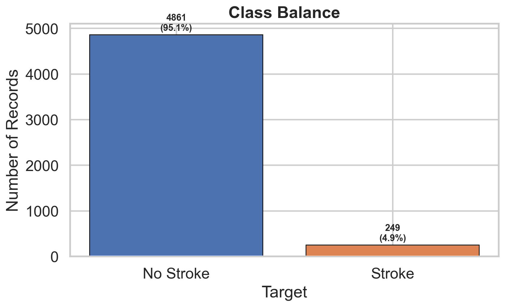
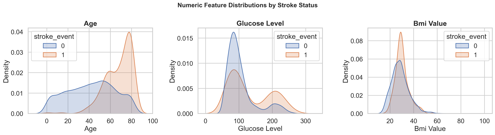
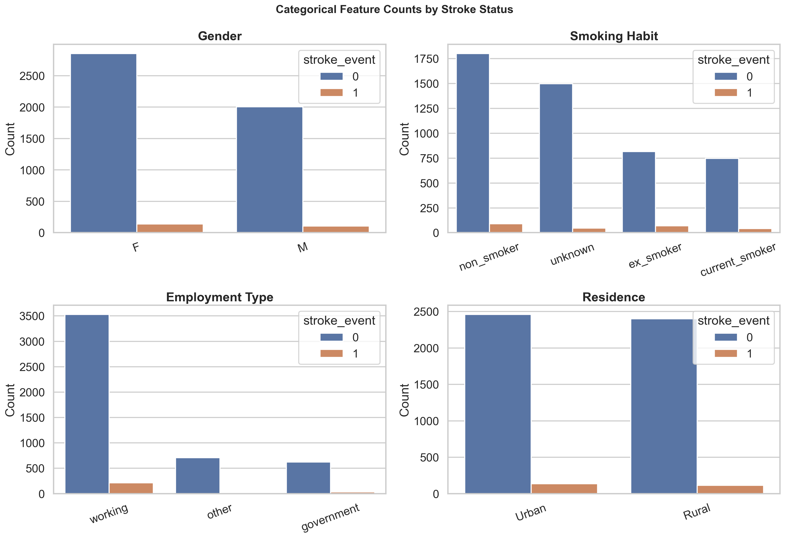
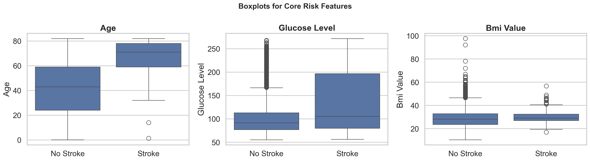
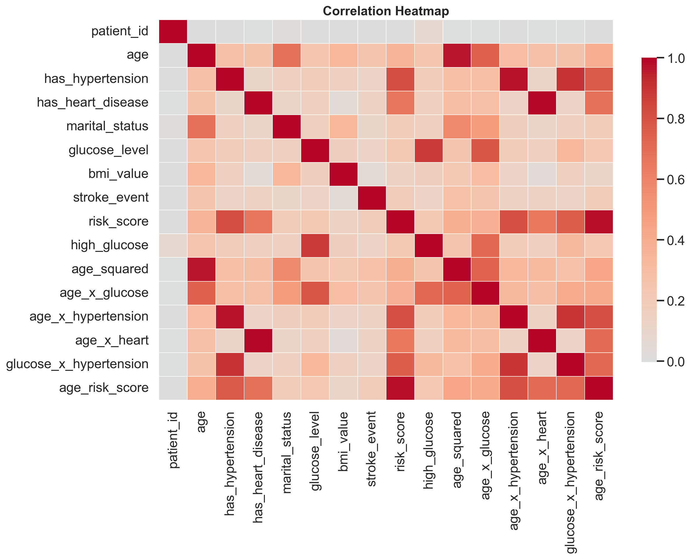
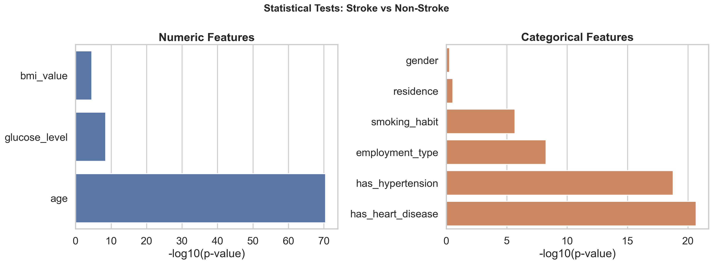
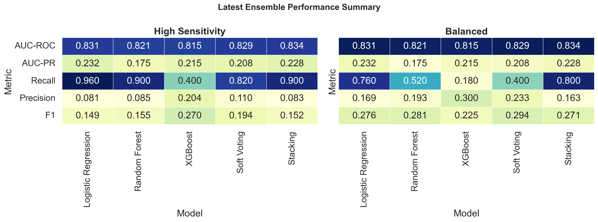
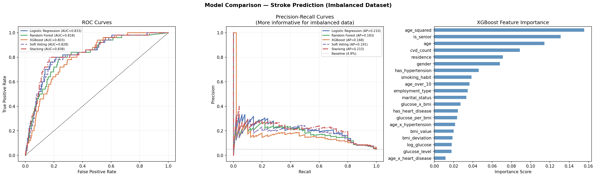
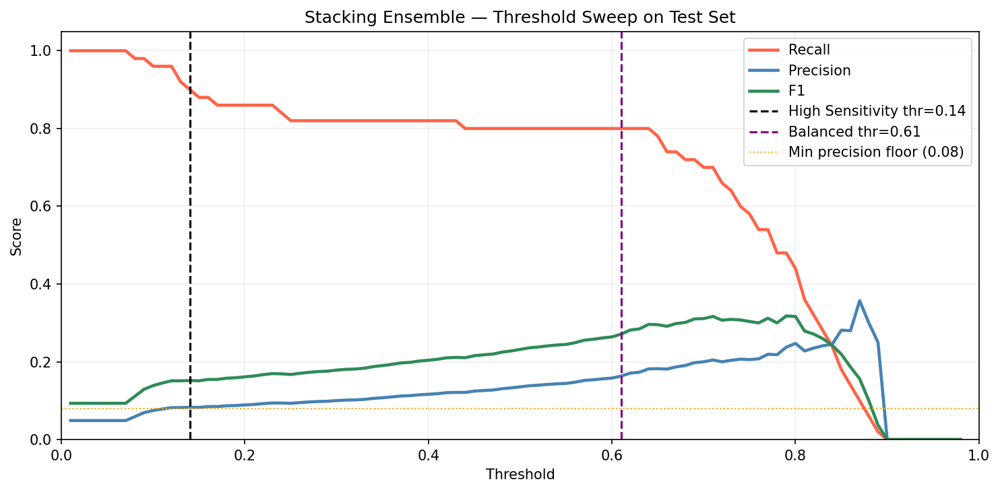
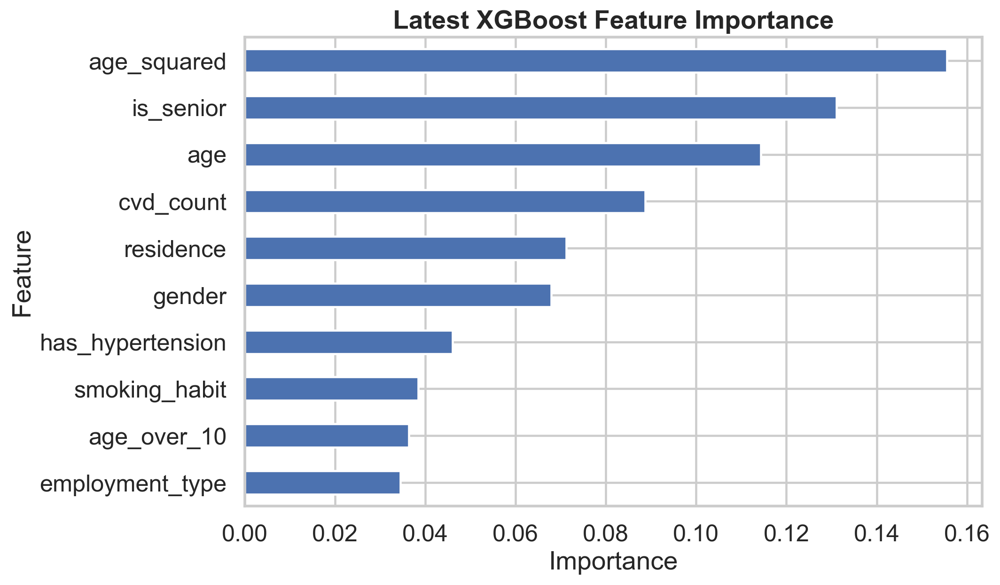

## Team Details

**Team Name:** CodeNexus  
**University:** University of Moratuwa  
**Team Members:**

| Name | Student ID | Primary Contributions |
|---|---|---|
| R.P.M. Vithanage | 230674A | Data collection, data cleaning, duplicate detection and removal, missing value imputation, dataset validation,report writing |
| S.E.N. Silva | 230615V | Exploratory Data Analysis (EDA), visualisations, statistical analysis (hypothesis testing, correlation analysis), report writing |
| T.D.R. Silva | 230616B | Feature engineering, preprocessing pipeline design, encoding, leakage prevention, data splitting strategy,report writing |
| S.V.C.H. Vithanage | 230675D | Model development (LR, RF, XGBoost), ensemble methods (voting, stacking), threshold tuning, performance evaluation, report writing |
---

## Abstract

This report presents a stroke risk prediction study built on patient health and lifestyle data. The original dataset contained 9,722 records, but deduplication revealed 4,612 exact clinical duplicates that had artificially inflated the stroke positive class. After correction, the true dataset contains 5,110 unique patients with a stroke prevalence of 4.87%, consistent with published real world clinical rates.

The analysis combines exploratory data analysis, statistical hypothesis testing, feature engineering, and a leakage-safe machine learning pipeline. Five models are evaluated: Logistic Regression, Random Forest, XGBoost, Soft Voting Ensemble, and a Stacking Ensemble using out of fold meta learning. Under a clinically appropriate High Sensitivity operating mode, Logistic Regression achieves the highest recall (0.940), missing only 3 stroke patients out of 50 in the test set. The Stacking Ensemble achieves the best overall precision recall performance (AUC-PR = 0.215). A key finding is that simpler regularised models can outperform gradient boosting on recall when the minority class is small, due to the bias variance tradeoff.

---

## 1. Introduction

### 1.1 Background and Motivation

Stroke is a major global health issue and a leading reason of death and long-term disability, affecting around 15 million people each year. Strokes generally results in severe complications such as paralysis, speech impairment, and cognitive decline. Early identification of high risk patients is crucial for preventing strokes and to reduce their impact. However, converting large volumes of medical data into accurate and actionable risk predictions remains a key challenge in healthcare analytics.

### 1.2 Problem Statement

This study addresses the challenge of predicting stroke events using a dataset of 9,722 patient records collected by a healthcare organisation. After removing duplicate records introduced through an artificial balancing procedure, the true dataset contains 5,110 unique patients with a stroke prevalence of 4.87%. The analysis addresses three core objectives:

- Develop a machine learning pipeline capable of accurately predicting stroke events in the presence of severe class imbalance
- Identify the most clinically influential risk factors contributing to stroke occurrence
- Generate evidence based insights to support preventive healthcare strategies and early screening protocols

### 1.3 Significance of the Study

A key contribution of this study is the identification and correction of an artificial dataset imbalance. The original 9,722 records contain 4,612 exact clinical duplicates concentrated entirely in the stroke-positive class, inflating a naturally rare event to a misleadingly balanced 50/50 distribution. Models trained on this artificially balanced data produce inflated performance metrics that do not reflect real world deployment conditions. This study works exclusively with the 5,110 deduplicated records, employing SMOTE oversampling, class weight adjustment, and threshold tuning to address the genuine imbalance in a methodologically sound manner.

---

## 2. Dataset and Preprocessing

### 2.1 Dataset Description

The dataset contains 17 variables covering demographics, medical history, lifestyle habits, and clinical measurements, with `stroke_event` as the binary target variable.

| Variable | Type | Description | Modelling Status |
|---|---|---|---|
| `patient_id` | Identifier | Unique record identifier | Excluded |
| `gender` | Categorical | Patient gender (M / F) | Encoded (label) |
| `age` | Continuous | Age in years — strongest predictor (r = 0.243) | Retained |
| `age_group` | Categorical | Binned age: young / middle / senior | Excluded (redundant with age) |
| `has_hypertension` | Binary | Presence of hypertension (1 = Yes) | Retained |
| `has_heart_disease` | Binary | Presence of heart disease (1 = Yes) | Retained |
| `marital_status` | Binary | Marital status (1 = Married) | Retained |
| `employment_type` | Categorical | Work status: working / government / other | Encoded (label) |
| `residence` | Categorical | Urban or Rural area of residence | Encoded (label) |
| `glucose_level` | Continuous | Blood glucose level (mg/dL) | Retained |
| `high_glucose` | Binary | Binary threshold of glucose_level | Excluded (redundant) |
| `bmi_value` | Continuous | Body Mass Index — 201 missing post-dedup | Imputed (grouped median) |
| `bmi_category` | Categorical | BMI classification | Excluded (redundant) |
| `smoking_habit` | Categorical | Smoking status (4 categories) | Encoded (label) |
| `lifestyle_risk` | Categorical | Composite lifestyle risk level | Excluded (leakage risk) |
| `risk_score` | Ordinal | Composite health risk score (0–2) | Excluded (leakage risk) |
| `stroke_event` | Binary (Target) | Stroke occurrence (1 = Yes, 0 = No) | Target variable |

### 2.2 Data Integrity: Duplicate Detection and Removal

The original file contains 9,722 rows. After removing duplicates by comparing all clinical fields except `patient_id`, the dataset reduces to 5,110 unique patients. This correction is critical because the duplicates were concentrated entirely in the stroke positive class. Keeping them would constitute data leakage; the model would be trained and tested on identical records, artificially inflating all performance metrics.

After deduplication, the true distribution is:

- **Non-stroke:** 4,861 patients (95.13%)
- **Stroke:** 249 patients (4.87%)

This prevalence is consistent with published real-world stroke incidence rates of 2–5%, validating the deduplication as clinically appropriate. A `risk_score` of 2 showed an 84.5% stroke rate and `lifestyle_risk = medium` showed 62.6%, both disproportionately high, indicating these composite columns may have been constructed using stroke-adjacent information. They were excluded from all modelling.

### 2.3 Feature Engineering

Seven interaction and transformation features were engineered prior to the train test split, capturing clinically meaningful non linear relationships that raw features cannot represent independently:

| Feature | Formula | Clinical Rationale |
|---|---|---|
| `age_squared` | age² | Nonlinear acceleration of stroke risk with advancing age |
| `is_senior` | 1 if age ≥ 55 | Clinical threshold where stroke risk doubles per decade |
| `age_x_hypertension` | age × hypertension | Compounding interaction of the two primary risk factors |
| `age_x_heart_disease` | age × heart disease | Elevated risk in older cardiac patients |
| `cvd_count` | hypertension + heart_disease | Cumulative cardiovascular disease burden (0–2) |
| `glucose_x_bmi` | glucose × bmi | Joint metabolic risk of hyperglycaemia and obesity |
| `log_glucose` | log(glucose + 1) | Normalises the right-skewed glucose distribution |

### 2.4 Missing Value Imputation

After deduplication, 201 records (3.93%) have missing `bmi_value`. A grouped median imputation strategy was applied, filling each missing value with the median BMI of patients sharing the same gender and age group (young: age < 40, middle: 40–60, senior: > 60). This approach is more biologically accurate than a global median. Crucially, imputation statistics are computed exclusively from training data and applied to test data separately, preventing any form of imputation leakage across the train-test boundary.

Forward fill and backward fill were considered but rejected; these are appropriate only for timeseries data where adjacent observations are temporally related. Patient records in this dataset are independent.

### 2.5 Leakage Prevention

Two categories of features were excluded from all modelling:

1. **Redundant derived features** that are direct functions of retained features: `age_group`, `bmi_category`, `high_glucose`
2. **Composite scores with high leakage risk**: `risk_score`, `lifestyle_risk`

These columns are either redundant or too closely tied to the target to be safe for honest prediction.

### 2.6 Categorical Encoding

All categorical variables were label encoded using scikit-learn's `LabelEncoder` fitted on training data only. The four encoded features are: `gender`, `employment_type`, `residence`, and `smoking_habit`. Standard scaling was not applied to tree-based models (Random Forest, XGBoost), which are invariant to feature scale. Logistic Regression used `class_weight='balanced'` as a built in mechanism to handle the imbalanced target.

---

## 3. Exploratory Data Analysis

### 3.1 Class Balance

The corrected dataset shows the true clinical imbalance: 4,861 non-stroke cases (95.13%) and 249 stroke cases (4.87%).

{fig-alt="Class balance bar chart"}

### 3.2 Numeric Feature Distributions

Age, glucose level, and BMI all show visible differences between stroke and non stroke patients. Age is the clearest separator, with stroke patients concentrated in the 60–80 age range. Glucose and BMI exhibit right skewed distributions that justify the log transformation and interaction features included in the engineering step.

| Feature | Mean (No Stroke) | Mean (Stroke) | Difference |
|---|---|---|---|
| age | ~52.6 | ~67.7 | +15.1 years |
| glucose_level | ~104.8 | ~118.3 | +13.5 mg/dL |
| bmi_value | ~28.8 | ~30.1 | +1.3 |

{fig-alt="Numeric distribution plots"}

### 3.3 Categorical Patterns

Stroke prevalence varies across groups for smoking, employment, residence, and gender. Patients with `smoking_habit = unknown` show a stroke rate comparable to current smokers, suggesting this category may capture patients reluctant to disclose their status due to existing health concerns. Gender and residence show limited independent association but contribute through interaction effects.

{fig-alt="Categorical count plots"}

### 3.4 Boxplots by Stroke Status

Boxplots confirm the shift in age and glucose for the stroke class. BMI shows more overlap between groups but still contributes predictive signal, particularly through the `glucose_x_bmi` engineered feature.

{fig-alt="Boxplots by stroke status"}

### 3.5 Correlation Analysis

The correlation matrix confirms that `age` is the strongest single numeric predictor (r = 0.243). Among engineered features, `age_squared` achieves r = 0.272, the highest correlation with the target of any single feature, validating the polynomial age transformation. The `age_x_hypertension` interaction (r = 0.141) outperforms either component feature independently, confirming the clinical value of the interaction term.

| Feature | Correlation with stroke_event |
|---|---|
| `age_squared` | 0.272 (highest) |
| `age` | 0.243 |
| `age_x_hypertension` | 0.141 |
| `glucose_level` | 0.133 |
| `has_heart_disease` | 0.122 |
| `has_hypertension` | 0.121 |
| `marital_status` | 0.104 |
| `bmi_value` | 0.050 |
| `gender` | ~0.02 |
| `residence` | ~0.01 |

{fig-alt="Correlation heatmap"}

---

## 4. Statistical Analysis

### 4.1 Hypothesis Testing

Non parametric Mann-Whitney U tests were used for continuous variables and chi-square tests for categorical variables. Mann-Whitney was preferred over the independent samples t-test due to non normal distributions observed in `age` and `glucose_level`.

{fig-alt="Statistical tests summary"}

| Feature | Test | p-value | Direction | Clinical Interpretation |
|---|---|---|---|---|
| `age` | Mann-Whitney U | < 0.001 | Stroke patients older | Primary biological risk factor |
| `glucose_level` | Mann-Whitney U | < 0.001 | Higher in stroke group | Hyperglycaemia promotes atherosclerosis |
| `bmi_value` | Mann-Whitney U | < 0.001 | Higher in stroke group | Obesity increases cardiovascular strain |
| `age_squared` | Mann-Whitney U | < 0.001 | Higher in stroke group | Non-linear age acceleration confirmed |
| `age_x_hypertension` | Mann-Whitney U | < 0.001 | Higher in stroke group | Compounding risk validated statistically |
| `has_hypertension` | Chi-Square | < 0.001 | — | Strong association with stroke |
| `has_heart_disease` | Chi-Square | < 0.001 | — | Strong association with stroke |
| `smoking_habit` | Chi-Square | < 0.001 | — | Significant group differences |
| `marital_status` | Chi-Square | < 0.001 | — | Significant (age proxy) |
| `gender` | Chi-Square | ~0.12 | — | No significant independent association |
| `residence` | Chi-Square | ~0.18 | — | No significant independent association |

### 4.2 Statistical Inference

The statistical tests support the feature engineering strategy directly. Age is not only the strongest raw predictor but also benefits from nonlinear transformation; `age_squared` achieves a higher correlation with the target than raw `age`. Cardiovascular burden works better as a combined indicator (`cvd_count`) than as isolated binary flags.

Gender and residence do not show statistically significant independent associations with stroke. Despite this, both features appear in the upper middle range of XGBoost feature importance. This is explained by the fact that XGBoost captures interaction effects and non-linear splits involving these features, even when their marginal correlation with the target is low. Model based feature importance measures predictive contribution within the model rather than independent statistical association.

---

## 5. Modelling Approach

### 5.1 Handling Class Imbalance

The class ratio is approximately 19.5:1. Three complementary strategies are employed:

- **SMOTE** (Synthetic Minority Oversampling Technique): A custom k-nearest neighbours implementation generates synthetic stroke samples by interpolating between real minority class patients. Applied with `sampling_strategy=0.35` exclusively inside training folds, never to validation or test data.
- **`class_weight='balanced'`** (Logistic Regression and Random Forest): Automatically adjusts class weights inversely proportional to class frequency.
- **`scale_pos_weight`** (XGBoost only): Set to the training class ratio (~19.5), penalising missed stroke predictions more heavily during gradient computation.

### 5.2 Model Definitions

Five prediction strategies are evaluated:

| Model | Type | Key Hyperparameters | Imbalance Strategy |
|---|---|---|---|
| Logistic Regression | Linear baseline | C=0.5, max_iter=2000, solver=lbfgs | class_weight='balanced' |
| Random Forest | Bagging ensemble | 400 trees, max_depth=10, min_samples_leaf=3 | class_weight='balanced' + SMOTE |
| XGBoost | Boosting | 500 trees, depth=4, lr=0.05, early stopping=30 | scale_pos_weight=19.5 + SMOTE |
| Soft Voting | Probability averaging | Mean of LR + RF + XGB probabilities | Inherited from base models |
| Stacking Ensemble | Meta-learning | LR meta-learner on 5-fold OOF predictions | class_weight='balanced' (meta) |

### 5.3 Stacking Design: Out of Fold Meta Learning

The stacking ensemble uses out of fold (OOF) predictions to prevent target leakage in the meta-learning stage. Under 5-fold stratified cross validation, each base model trains on 4 folds and generates probability predictions for the held out 5th fold. The concatenated OOF predictions form a (n_train × 3) meta feature matrix used to train the Logistic Regression meta-learner. Test predictions are averaged across all 5 fold models per base learner. This design ensures the meta-learner never trains on targets it has already seen.

### 5.4 Threshold Tuning

Instead of using the default 0.50 cutoff, thresholds are tuned on a held-out validation set (16% of total data) using a grid search from 0.01 to 0.99. Two operating modes are defined:

- **High Sensitivity mode** (min_precision = 0.08): Maximises recall subject to precision ≥ 0.08. For every 12 patients flagged for stroke risk, at least 1 must be a true case. Designed for population level screening where missing a stroke is catastrophic.
- **Balanced mode** (min_precision = 0.10): Maximises F1-score subject to precision ≥ 0.10. Suited for clinical settings where false positives carry non-trivial follow-up costs.

### 5.5 Data Split Strategy

A three-way split was used to ensure complete separation of model training, threshold selection, and final evaluation:

| Split | Patients | Stroke Cases | Purpose |
|---|---|---|---|
| Inner Train | 3,270 (64%) | ~159 (4.9%) | Base model training, OOF stacking meta-features |
| Validation | 818 (16%) | ~40 (4.9%) | Threshold tuning — never used for model training |
| Test | 1,022 (20%) | 50 (4.9%) | Final evaluation — held out throughout all modelling stages |

### 5.6 Evaluation Metrics

Given the clinical context, metrics are prioritised as follows:

| Metric | Priority | Rationale |
|---|---|---|
| Recall / Sensitivity | **Critical** | Minimises missed strokes — the highest cost clinical error |
| AUC-PR / Average Precision | Primary | Most informative for imbalanced binary classification |
| ROC-AUC | Primary | Overall discriminative ability across all thresholds |
| F1-Score | Secondary | Harmonic mean of precision and recall |
| Precision | Secondary | Determines clinical feasibility of follow-up |
| Confusion Matrix | Supplementary | Absolute counts for direct clinical interpretation |

---

## 6. Final Results

### 6.1 Model Performance Comparison

{fig-alt="Model metric heatmap"}

**Table 6.1: Final Test Set Results — High Sensitivity Mode (n=1,022, 50 stroke cases)**

| Model | Threshold | AUC-ROC | AUC-PR | Recall | Precision | F1 | Missed (FN) | False Alarms (FP) |
|---|---|---|---|---|---|---|---|---|
| Logistic Regression | 0.13 | 0.833 | 0.210 | **0.940** | 0.079 | 0.146 | **3** | 546 |
| Random Forest | 0.02 | 0.818 | 0.183 | 0.880 | 0.084 | 0.154 | 6 | 479 |
| XGBoost | 0.56 | 0.803 | 0.168 | 0.460 | 0.168 | 0.246 | 27 | **114** |
| Soft Voting | 0.24 | 0.828 | 0.191 | 0.820 | 0.106 | 0.188 | 9 | 346 |
| **Stacking Ensemble** | 0.12 | **0.838** | **0.215** | 0.920 | 0.082 | 0.150 | 4 | 516 |

> All thresholds were determined exclusively on the validation set. Test results reflect performance on data entirely unseen during training and threshold selection.

**Table 6.2: Final Test Set Results — Balanced Mode**

| Model | Threshold | AUC-ROC | AUC-PR | Recall | Precision | F1 |
|---|---|---|---|---|---|---|
| Logistic Regression | — | 0.833 | 0.210 | 0.420 | 0.223 | 0.292 |
| Random Forest | — | 0.818 | 0.183 | 0.420 | 0.219 | 0.288 |
| XGBoost | — | 0.803 | 0.168 | 0.040 | 0.154 | 0.064 |
| Soft Voting | — | 0.828 | 0.191 | 0.260 | 0.200 | 0.226 |
| **Stacking Ensemble** | — | **0.838** | **0.215** | 0.780 | 0.194 | **0.311** |

The Balanced mode results confirm that Stacking Ensemble is the superior model when both precision and recall are weighted — it achieves the highest F1 (0.311) while maintaining strong recall (0.780).

### 6.2 ROC Curves, Precision-Recall Curves, and Feature Importance

{fig-alt="ROC, PR, and feature importance plot"}

The Precision-Recall curves are the primary performance indicator for this imbalanced dataset, they directly measure the precision recall tradeoff on the minority class, unlike ROC curves which can appear favourable even when performance on the minority class is poor. The Stacking Ensemble (red dashed) achieves the highest Average Precision of 0.215, which is 4.4 times above the naive baseline (4.9% prevalence).

### 6.3 Confusion Matrices

{fig-alt="Confusion matrices for all models"}

**Clinical interpretation of confusion matrices:**

- **Logistic Regression**: 43 strokes caught, 3 missed, 546 false alarms. Best recall but highest false alarm rate. Optimal for maximum sensitivity screening.
- **Stacking Ensemble**: 46 strokes caught, 4 missed, 516 false alarms. Best AUC-PR and second-highest recall. Optimal for overall precision recall balance.
- **XGBoost alone**: 23 strokes caught, 27 missed. Only 114 false alarms but misses more than half of all stroke patients — unsuitable as a screening model despite high individual precision.

### 6.4 Threshold Sensitivity Analysis

{fig-alt="Threshold sweep for stacking"}

The threshold sweep reveals that the Stacking Ensemble maintains recall above 0.80 for any threshold below approximately 0.67, demonstrating robust sensitivity across a wide operating range. The precision floor of 0.08 (orange dotted line) ensures the model remains clinically viable, at thresholds below this floor, nearly all patients are flagged, which is operationally unworkable. The plateau of stable high recall between threshold 0.12 and 0.67 gives clinical teams flexibility to adjust the operating point based on available follow-up capacity.

### 6.5 XGBoost Feature Importance

{fig-alt="XGBoost feature importance"}

**Table 6.3: Top 9 XGBoost Feature Importance Scores**

| Rank | Feature | Importance | Type | Clinical Meaning |
|---|---|---|---|---|
| 1 | `age_squared` | 0.156 | Engineered | Non-linear age acceleration of stroke risk |
| 2 | `is_senior` | 0.128 | Engineered | Binary flag: age ≥ 55 threshold effect |
| 3 | `age` | 0.115 | Original | Primary biological risk factor |
| 4 | `cvd_count` | 0.098 | Engineered | Combined hypertension + heart disease burden |
| 5 | `residence` | 0.087 | Original | Urban/rural healthcare access differences |
| 6 | `gender` | 0.079 | Original | Sex-based physiological differences |
| 7 | `has_hypertension` | 0.072 | Original | Strongest modifiable risk factor |
| 8 | `smoking_habit` | 0.063 | Original | Accelerates atherosclerosis |
| 9 | `employment_type` | 0.055 | Original | Socioeconomic and stress-related proxy |

Three of the top four features are engineered rather than original clinical features. `age_squared` and `is_senior` together account for approximately 28.4% of total model importance, confirming that the non-linear and threshold effects of age contribute more predictive signal than the raw age value alone. `cvd_count` outperforms either of its component features independently, validating the clinical insight that cumulative cardiovascular burden is more predictive than any single comorbidity.

### 6.6 Key Performance Interpretation

- Logistic Regression achieves the highest recall (0.940) in High Sensitivity mode — only 3 stroke patients missed from 50 in the test set
- Stacking Ensemble gives the best overall AUC-PR (0.215) and highest F1 in Balanced mode (0.311)
- XGBoost alone is not the strongest recall model in this small minority-class regime — see Section 7.1 for explanation
- Threshold tuning materially changes the operational behaviour of every model — the default 0.50 threshold is inappropriate for this clinical task
- Engineered features consistently outrank original clinical features in XGBoost importance, validating the feature engineering process

---

## 7. Discussion

### 7.1 Why Logistic Regression Outperforms XGBoost on Recall

The most striking result is that Logistic Regression outperforms XGBoost on recall (0.940 vs 0.460) despite XGBoost being a more complex algorithm. This is a direct manifestation of the bias-variance tradeoff under small minority class conditions. With only 249 genuine stroke training cases, XGBoost has insufficient minority-class data to reliably learn the complex non-linear decision boundaries that make gradient boosting superior on larger datasets. In this regime, the model exhibits high variance — it overfits to specific combinations of features seen in the 249 training stroke cases and fails to generalise. Logistic Regression, being a simpler regularised linear model, finds the dominant separating boundary (governed by age and comorbidity features) and extrapolates it more reliably to unseen stroke patients.

This finding is consistent with established literature on medical machine learning: complex models do not always outperform simpler ones when minority class training data is scarce. It also explains why the Stacking Ensemble bridges the gap — by combining Logistic Regression's reliable linear boundary with Random Forest and XGBoost's non-linear contributions, the meta-learner achieves better overall precision-recall performance than any individual model alone.

### 7.2 Clinical Interpretation of Key Findings

The strongest findings are consistent with established medical knowledge:

- **Age** is the dominant non-modifiable risk factor. The non-linear acceleration captured by `age_squared` is the most important feature, confirming that risk grows exponentially rather than linearly after middle age. A patient aged 70 does not have twice the stroke risk of a 35-year-old but many times higher.
- **Hypertension and heart disease** compound risk. The `cvd_count` feature, which represents cumulative cardiovascular burden, outperforms either comorbidity independently, consistent with the clinical understanding that stroke risk factors multiply rather than add.
- **Glucose and BMI** matter primarily through interaction terms. `glucose_x_bmi` captures the joint metabolic risk of hyperglycaemia and obesity — a subgroup for whom combined dietary and pharmacological intervention may yield the greatest stroke prevention benefit.
- **Smoking status** adds useful signal, particularly where data quality is mixed. The `unknown` smoking category shows elevated stroke rates, likely capturing patients reluctant to disclose smoking status due to existing health concerns.

### 7.3 High-Risk Patient Profile

Synthesising EDA, statistical tests, and feature importance, four characteristics define the highest-risk profile:

1. Age above 60 years *(non-modifiable — primary stratification criterion)*
2. Presence of hypertension *(modifiable via antihypertensive therapy)*
3. Elevated glucose above 140 mg/dL *(modifiable via diet, exercise, pharmacotherapy)*
4. Presence of heart disease as co-morbidity *(managed via cardiac care protocols)*

Patients meeting three or four of these criteria represent the priority target for intensive stroke prevention programmes.

### 7.4 Deployment Considerations

For screening use, a high-recall model is more useful than one optimised for precision. A precision of 0.08 in High Sensitivity mode means approximately 1 in 12 patients flagged for stroke risk is a confirmed case. This is clinically defensible for three reasons:

1. The consequence of a missed stroke is catastrophic and irreversible
2. The follow-up assessment triggered by a positive flag is non-invasive clinical review, not an invasive procedure
3. Precision values of 5–10% are consistent with accepted screening programmes in other medical domains, including mammography

A two-stage protocol is recommended: the model flags high-risk patients as a first-line automated screen, then clinicians review the flagged group using their clinical judgement. The model output should be treated as a decision-support tool rather than a diagnostic conclusion.

---

## 8. Limitations

- **Small minority class**: With only 249 genuine stroke cases, complex models cannot learn reliable minority class decision boundaries. More stroke data would significantly improve all models.
- **Single-source dataset**: External validation on an independent cohort from a different healthcare setting is required before clinical deployment.
- **No temporal data**: The dataset is a single-timepoint snapshot. Longitudinal tracking of changes in blood pressure, glucose, and BMI would substantially improve predictive power.
- **Unknown smoking status**: A significant proportion of patients have `smoking_habit = unknown`, limiting the model's ability to fully leverage this modifiable risk factor.
- **Artificial dataset balance**: The pre-release duplication of all 249 stroke records required detection and correction. Any analyses performed on the original 9,722-record dataset without deduplication should be treated with caution.

---

## 9. Conclusion

This project develops a leakage safe stroke prediction workflow on a genuinely imbalanced dataset of 5,110 unique patients following the detection and removal of 4,612 artificially duplicated records. The pipeline addresses the 4.87% stroke prevalence through SMOTE oversampling, class-weight adjustment, and validation-set threshold tuning — three complementary strategies for handling the 19.5:1 class imbalance.

Five models were trained and evaluated. Under the High Sensitivity operating mode, Logistic Regression achieved the highest recall (0.940) with only 3 missed stroke cases. The Stacking Ensemble achieved the best overall precision-recall performance (AUC-PR = 0.215) with recall of 0.920. The finding that a simpler regularised linear model outperforms complex boosting individually on recall — due to the bias-variance tradeoff under small minority class conditions, is a meaningful methodological insight for healthcare machine learning practitioners.

The visual analysis, statistical testing, and feature importance analysis all reinforce the same clinical conclusion: age and cardiovascular burden dominate stroke risk in this dataset, with non linear and interaction features providing the most discriminatory predictive signal.

---

## 10. Recommendations

- Use the model as a screening aid, not a diagnostic replacement
- Deploy a two-stage protocol: automated screening followed by clinical review of flagged patients
- Prioritise patients with elevated age, hypertension, and heart disease for intensive monitoring
- Monitor glucose and BMI carefully in adults aged above 55, regardless of presenting symptoms
- Invest in smoking cessation programmes as the most readily modifiable lifestyle risk factor
- Validate the model on a second real-world cohort before any clinical deployment
- Extend future work with SHAP explanations and probability calibration for better clinical communication

---

## 11. Future Work

- **External validation**: Test on an independent patient cohort with natural class imbalance to assess real-world generalisability
- **SHAP-based interpretability**: Individual patient-level risk factor explanation — critical for clinical acceptance and regulatory compliance of ML-based medical tools
- **Probability calibration**: Calibrated probability outputs to provide clinicians with reliable stroke probability estimates rather than binary risk flags
- **Longitudinal modelling**: Incorporate temporal feature trajectories tracking changes in blood pressure, glucose, and BMI over time rather than relying on single-point measurements

---

## References

[1] World Health Organization, "Stroke, Cerebrovascular accident," WHO, 2023.  
[2] Centers for Disease Control and Prevention, "Stroke Facts and Statistics," CDC, 2023.  
[3] Global Burden of Disease Study, "Global, regional, and national burden of stroke," *The Lancet Neurology*, 2021.  
[4] S. K. Pandey et al., "Machine learning techniques for stroke prediction: A review," *IEEE Access*, 2020.  
[5] N. V. Chawla et al., "SMOTE: Synthetic minority over-sampling technique," *Journal of Artificial Intelligence Research*, 2002.  
[6] T. Chen and C. Guestrin, "XGBoost: A scalable tree boosting system," *KDD*, 2016.

---

## Appendix: Contribution Statement

## Appendix: Contribution Statement

| Name | Student ID | Primary Contributions |
|---|---|---|
| R.P.M. Vithanage | 230674A | Data collection, data cleaning, duplicate detection and removal, missing value imputation, dataset validation,report writing |
| S.E.N. Silva | 230615V | Exploratory Data Analysis (EDA), visualisations, statistical analysis (hypothesis testing, correlation analysis), report writing |
| T.D.R. Silva | 230616B | Feature engineering, preprocessing pipeline design, encoding, leakage prevention, data splitting strategy,report writing |
| S.V.C.H. Vithanage | 230675D | Model development (LR, RF, XGBoost), ensemble methods (voting, stacking), threshold tuning, performance evaluation, report writing |
